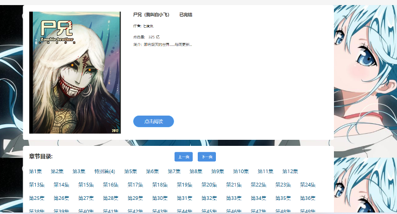

### 项目简介

mangastar 是一套基于当下最新的 java 技术栈 Spring Boot 3 + Vue 3 开发的前后端分离的漫画阅读投稿网站，包含漫画阅读系统、作家系统、平台管理系统等，包括漫画阅读、推荐系统、排行榜、搜索服务等功能，项目的目的是学习交流、练习对知识的掌握度和熟练度，项目采用真实的数据，配置有专门的爬虫模块，服务器采用2核4GB+2核2GB。

### 项目地址

- <a href="https://github.com/pigeoncat/mangastar.git">GitHub</a>
- <a href="https://gitee.com/guo-jianwuuuuuuuuuuu/mangastar.git">码云</a>

### 开发环境

- MySQL 8

- Redis 7

- Elasticsearch 8

- RabbitMQ 3

- JDK 17

- Maven 3.6

- IntelliJ IDEA 2021

- Node 16

  

### 技术选型

具体版本号见代码pom文件

Spring Boot 3

MyBatis 3.5

MyBatis-Plus 3.5

JJWT   0.11.5

Caffeine  3.1

Redis  7

Redisson 3

MySQL 8

Elasticsearch 8

RabbitMQ 3

Sentinel  1.8

Springdoc-openapi   2

Httpclient

Jsoup

Vue 3

Vue Router

axios

Vuex

element-plus

Docker


### 项目截图





### 项目结构

#### comic-star模块，后端服务模块

```
io.github.pigeoncat.comicstar
	>controller -------- 控制器，和前端交互
	>core
		>annotation  ------ 自定义注解实现aop功能增强
		>aspect      ------ aop切面
		>auth        ------ 用户权限相关
		>commom      ------ 基础包
		>config      ------ 配置类
		>constant    ------ 常量
		>filter      ------ 过滤器
		>interceptor ------ 拦截器
		>json        ------ json解析
		>listener    ------ 监听器
		>util        ------ 工具类
		>wrapper     ------ 包装器，解决xss问题
	>dao   -------- 实体类
	>dto   -------- 传输对象
	>manager ------ 管理器，负责缓存的管理
	>service ------ 服务实现类
  ComicStarApplication ----- 启动类
```

#### spider 爬虫模块

```
io.github
	>spider ------ 爬虫主体模块
		>common ----- 基础包，包含一些常量
		>config ----- 配置类
		>run    ----- 爬虫启动器
		>service ---- 服务实现类
		>util   ----- 工具包，包括全局id生成器，解析器，线程池等
		>vo    ------ 爬虫网页实体封装传输对象
		>website ---- 爬虫站点类以及爬虫接口
	>spidercommon
		>constant ----- 常量
		>dto  --------  传输对象
		>entity -----   通用实体类
		>mapper ------  映射文件
SpiderApplication --------------- 服务启动类
```

#### comicmq 消息队列、mysql存储、ES存储模块

```
io.github
	>comicmq ------ 消息队列主体模块
		>common ----- 基础包，包含一些常量
		>config ----- 配置类
		>entity ----- 实体类
		>listener --- 消息队列监听器
		>service ---- 服务实现类
		>util   ----- 工具包，包括全局id生成器等
	>spidercommon
		>constant ----- 常量
		>dto  --------  传输对象
		>entity -----   通用实体类
		>mapper ------  映射文件
ComicmqApplication --------------- 服务启动类
```

### 项目架构


### 安装说明

准备好 mysql 环境，ES 环境，Rabbitmq 环境

一共四个模块，comic-star、spider、comicmq、comicstar-front-web

各模块之间都是解耦的，启动顺序无所谓

建议顺序

1、comicmq

2、spider

3、comicstar

4、front-web

详细说明见资料

### 免责声明

本项目提供的爬虫工具仅用于采集项目初期的测试数据，请勿用于商业盈利。 用户使用本系统从事任何违法违规的事情，一切后果由用户自行承担，作者不承担任何责任。

